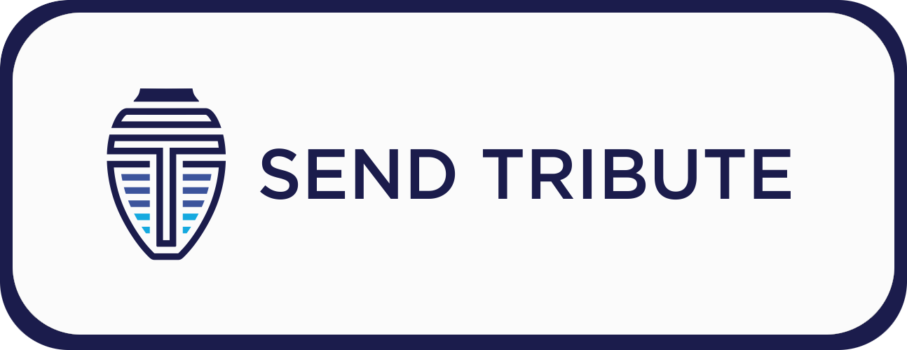
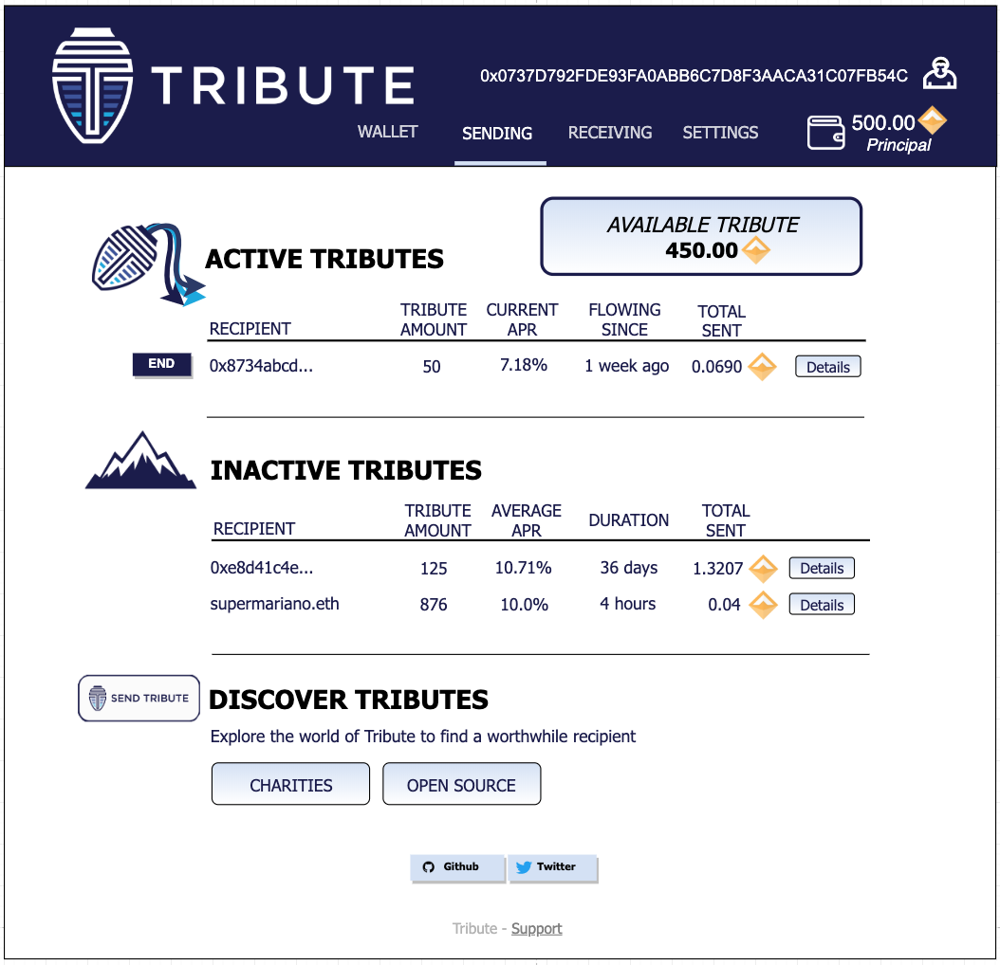
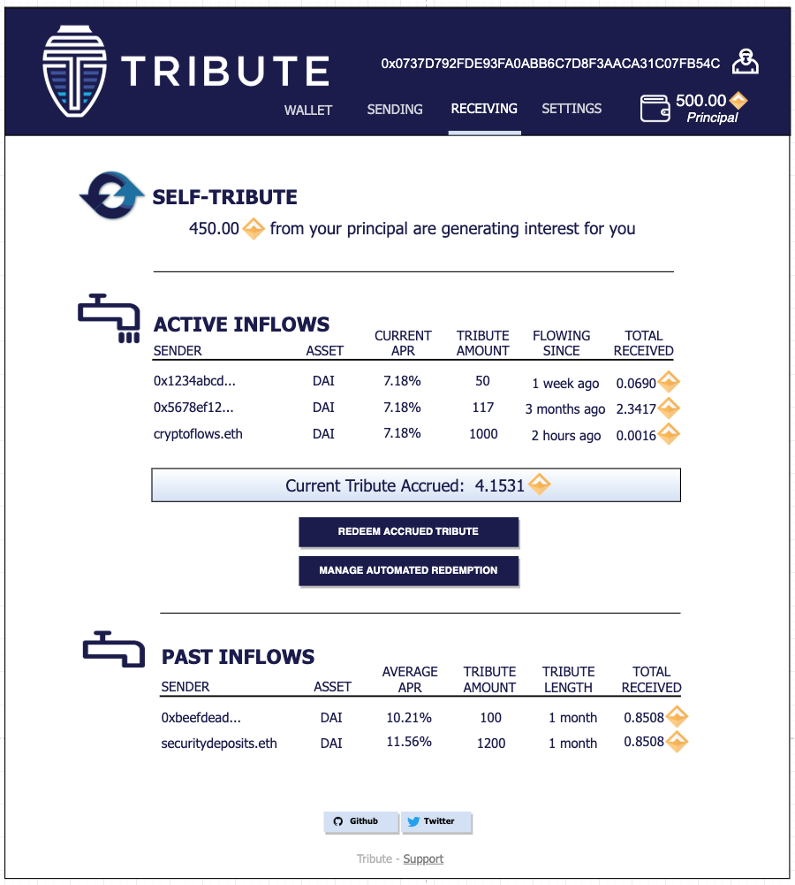

## Overview

Tribute overview.

## Getting Started
### Recipient Widget
Recipients can place the Send Tribute widget button on their sites, allowing their users to interact with the Tribute system. 

Clicking the button opens a widget window that can be customized by the recipient to set the relevant Tribute parameters. An example widget for an open source project donation might look something like this.

### Dashboard

### Smart Contract Dependencies
#### Kovan Testnet
##### DAI: [0xbF7A7169562078c96f0eC1A8aFD6aE50f12e5A99](https://kovan.etherscan.io/address/0xbF7A7169562078c96f0eC1A8aFD6aE50f12e5A99)
##### cDAI: [0x0a1e4d0b5c71b955c0a5993023fc48ba6e380496](https://kovan.etherscan.io/address/0x0a1e4d0b5c71b955c0a5993023fc48ba6e380496)
##### DaiCompoundAllocationStrategy (latest): [0xb4377efc05bd28be8e6510629538e54eba2d74e3](https://kovan.etherscan.io/address/0xb4377efc05bd28be8e6510629538e54eba2d74e3)
##### rDAI (latest): [0xea718e4602125407fafcb721b7d760ad9652dfe7](https://kovan.etherscan.io/address/0xea718e4602125407fafcb721b7d760ad9652dfe7)
